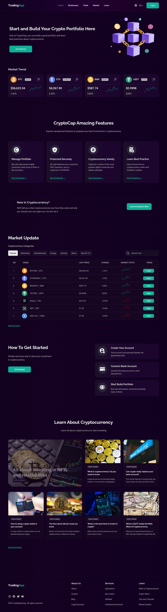
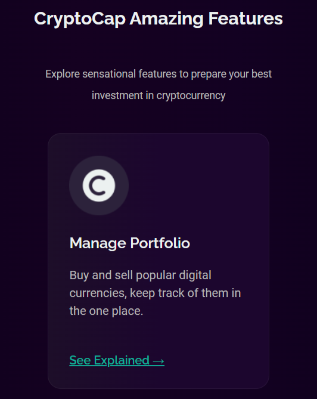
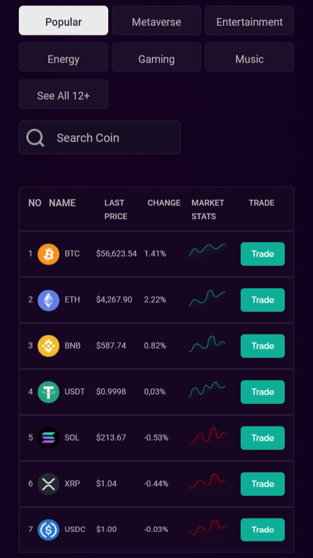

# Crypto_Currency_Trading_Platform

<h2>👋 Introduction </h3>
Beautiful responsive landing page design ui of a Crypto Currency Trading Platform using ReactJS and css. Color Gradient Landing Page design ui for any website.

<h2>▶️ Live Demo  :- <a href="https://responsive-landing-page-design-ui.netlify.app/">Visit </a>

<h2>😍  Preview </h3>

<table>
  <tr>
    <td>Laptop View</td>
     <td>Tablet View</td>
     <td>Mobile View</td>
  </tr>
  <tr>
    <td></td>
    <td></td>
    <td></td>
  </tr>

 </table>

<h2>🛠️ Technology Used</h3>

This project uses the following technologies:

- React.JS

- CSS

- HTML

<h2>⚙️ Installation & Getting started :</h3>

To run the application locally, follow these steps :

1. Download the repository

2. Unzip folder and open it with [VS Code](https://code.visualstudio.com/)

3. Open terminal & install dependencies by running `npm install` command

4. Run the command `npm start` to start live server

5. Click on `http://localhost:3000/`

6. Congratulation 🎉 you have setup the environment successfully

<h2> Do not forget to give a star! ⭐🤗 </h2>
